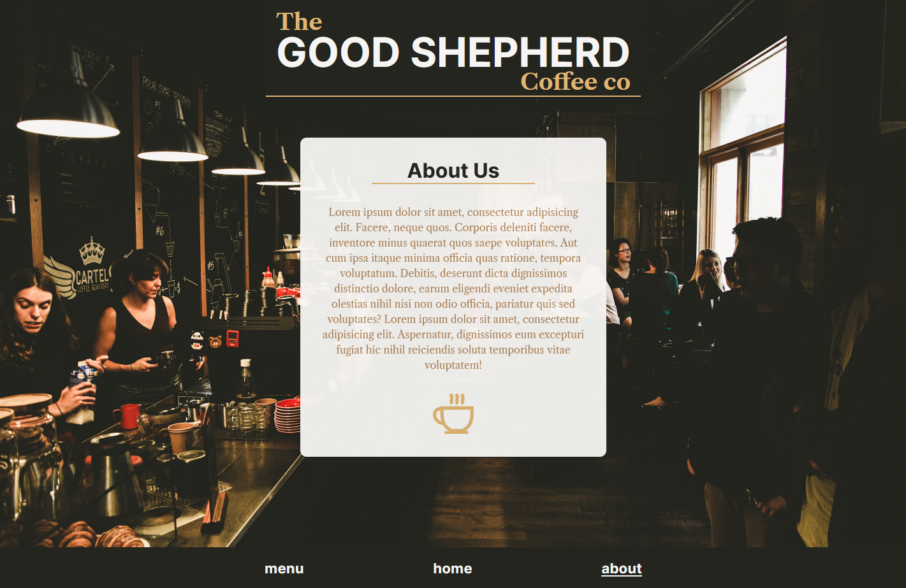

# The Good Shepherd

### A wee page for a nonexistant cafe in Lake Tekapo, NZ

## Learning Outcomes

- Design via use of Figma
- More use of CSS variables / general tidiness
- Display fun with event listeners
- Creation of my own SVG ( coffee cup and download icon! )

### Credits

Google Fonts for the <a href="https://fonts.google.com/specimen/Inter">Inter</a> and <a href="https://fonts.google.com/specimen/Libre+Caslon+Text">Libre Caslon Text</a> fonts.

<a href="https://unsplash.com/@bashton">Benjamin Ashton</a> from Unsplash for the wonderful <a href="https://unsplash.com/photos/T0VOOuz75_w">photo.</a>
